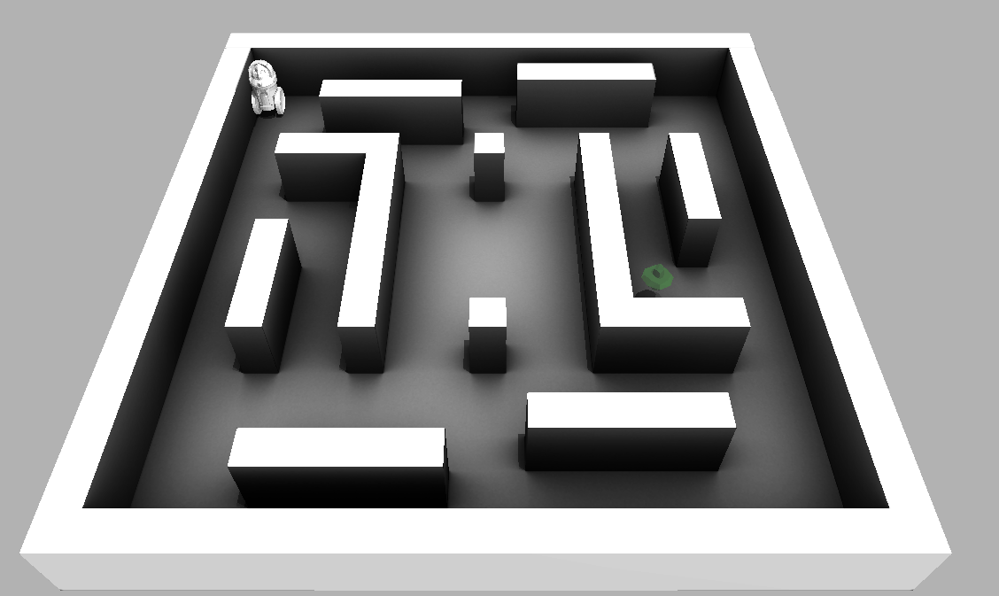
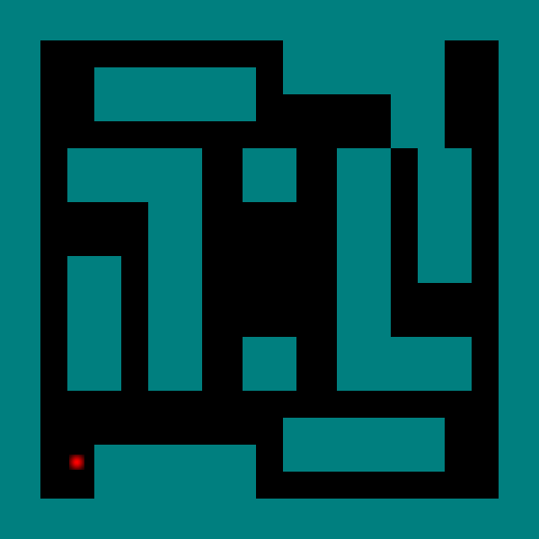
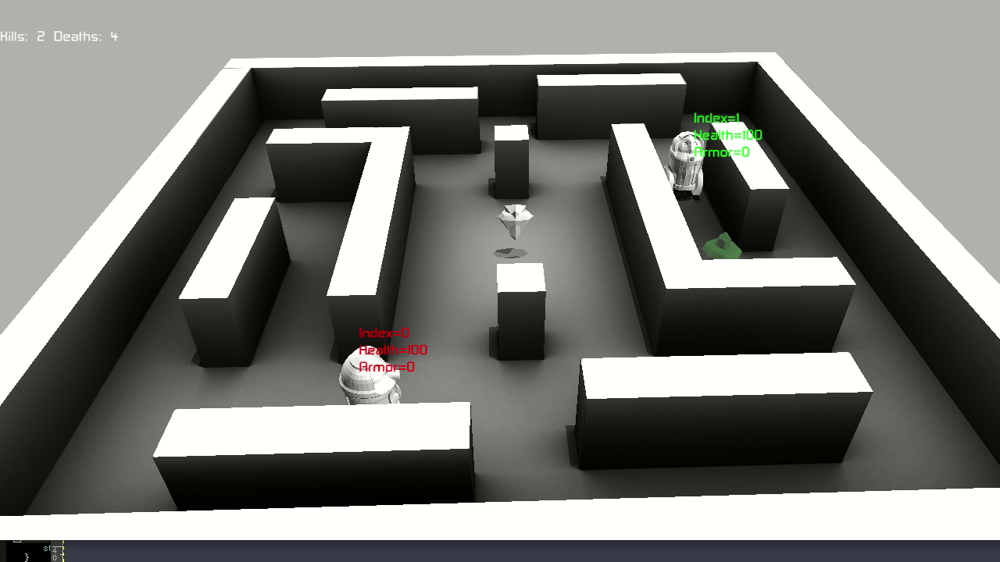

# Building

## Source Layout

* [src/*.*](src): c++ code relating to the world / simulation environment
* [src/agent](src/agent): Code relating to agents
* [src/geometry](src/geometry): Simple collision detection
* [src/proto](src/proto): Protos that define agent state / observations
* [src/python](src/python): Python bindings for the c++ code
* [src/tools](src/tools): Binaries for validation and generation of ambient occlusion
* [src/ui](src/ui): Simple rendering / Ogre rendering / "UI code"


## Requirements

(TODO: add links)

Most of the C++ dependencies can be found in the bazel WORKSPACE
file. The rest of the dependencies are:

* Bazel
* pybind
* python3
* stable-baselines:
    Fetch URL: https://github.com/hill-a/stable-baselines
    Hash: 259f27868f0d727d990f50e04da6e3a5d5367582

## Building

The environment/simulation code is written in c++. You must first
build the python module that will allow us to train an agent in python:

```
bazel build -c opt //src/python:battle_ai.so //src/ui:ui
```

## Training a simple agent



Before trying to learn complicated strategies / agents (and
also since I have no idea what I'm doing), I created a simple agent
where the actions are which direction the agent should move,
and the reward is proportional to whether the agent picks up a
power-up or not.

Action Space:

*  Discrete direction (8-directions, sideways and diagonals)

Observation space

* 2D Position of the agent
* Agent health
* Agent armor
* Time until next powerup spawn

Reward:

* Increase in health or armor from getting a power-up
* Minus 1 if the action caused no movement (e.g., hitting a wall)
* [Optional] Small reward proportional to movement (commented out in code)


python/find_powerups.py
python/train_find_powerups.py

python3 train_find_powerups.py --model=DQN --train=True

For 1M iterations, you should start to see episode reward >= 140 (at about) 700K)

Expected behavior: go to 1 power-up, then over to another while one is still spawning,
 then back to another spawn point (etc.)


To simulate some runs with the agent, use:
```
python3 python/train_find_powerups.py --model=DQN --train=False
```

```
    env = find_powerups.FindPowerupsEnv(args.filename)
    env = make_vec_env(lambda: env, n_envs=1)
    model = QRDQN('MlpPolicy', env, verbose=2,
                  learning_rate = 0.0005, 
                  buffer_size=1000000,
                  exploration_initial_eps=1,
                  exploration_fraction=0.95,
                  exploration_final_eps=0.01)
    if not args.train:
        model.exploration_rate = 0.01
```

### Example Results
The resulting agent does learn to find the locations of 2 of the power-ups
(the health power up (middle left) and armor (center). The agent then 
seems to just sit idle in the top left corner waiting for the items to respawn.
There is another health on the right hand side that the agent doesn't find.



And you can see the results in the following video
 [single_agent_ui.mp4](https://www.youtube.com/watch?v=TCylBJaad6E).

## Training the high-level agent

As I didn't want to wait forever to train an agent capable of learning simple
strategies before learning any more higher-level behaviors, the high level
agent is parameterized using a higher-level set of actions.

Each step, the agent chooses from one of 4+N actions, where N is the number
of power ups in the level. There are 4 directional actions: forward, backward,
left, right.

For a new action (different from previous), the agent creates a plan in
the direction of movement (1 unit distance in the world) that includes
avoiding obstacles. The default size of the world is a [10, 10] and max
velocity is 4, so moving from one end of the world to the other takes 5 seconds.

The other N actions correspond moving along an optimal path towards one of the
powerups. Agent training happens at the granularity of 1/2 a second in the world
time, and the simulation runs 15 iterations with a time delta of 1/30th of a second
to achieve this.

In the case that the action is FORWARD and an opponent is visible, the search
plan will be along the direction to the opponent.

If the action is the same as the previous action, the same plan is followed
until it is complete (or action is changed). And if it is completed, a new
plan is created as described above.

Features / state include:

* 2D position of the agent.
* Agent's health and armor.
* For each power up:
  * Distance (of plan) for agent to powerup
  * Normalized time to respawn
  * Distance of the agent to the powerup
* Distance from agent to opponent agent (last position if known)	
* Distance from agent to wall in each direction (in each direction); maximum of 1
* Distance from agent to next point on the plan
* Last action.

The rewards tested include:

* No motion: penalty for not moving.
* Health increase: reward for an increase in health.
* Armor increase: reward for an increase in armor.
* Other health decrease: reward for when other agent health decreases (default = 0)
* Other armor decrease: reward for when other agent armor decreases (default = 0)
* Kill: reward for when agent kills other agent (default = 1).
* Die: reward for when agent dies (default = -0.01).
* Change plan: penalty for changing plan.

For the most part, I was unable to find a reward setting (and model / training parameters) that
gave a great AI agent. In general, keeping the "kill" reward to be high was mostly beneficial in 
getting an agent didn't do horrible.

#### Hard-coded SimpleAgent 
There is a hard-coded SimpleAgent ([simple_agent.cc](src/agent/simple_agent.cc)) is used as
 a training opponent that makes a plan and sticks to it with probability of 1 - replan_rate
(or if the path is obstructed). When considering a replan, with a probability of 
"favor_powerups", the agent will prefer to consider moving to a powerup.  Powerups
are considered if the agent would gain something from going to them (e.g., if they
need armor or health). Distance, time to respawn are factors in ranking powerup
priority. If there are no candidate powerups, the agent will do a random search.

The parameters controlling shoot_rate, shoot_confidence, and accuracy are common
between the hard-coded SimpleAgent and the RL high-level agent.

Lots of magic numbers in the implementation.
 

```
message SimpleAgentParams {
  optional double accuracy = 1 [default = 0.8];
  optional double replan_rate = 2 [default = 0.01];
  optional double shoot_rate = 3 [default = 0.5];
  optional double shoot_confidence = 4 [default = 0.0];
  optional double replan_obstruction_distance = 5 [default = 2.0];
  optional double aggressiveness = 6 [default = 0.5];
  optional double favor_powerups = 7 [default = 1.0];
}
```

#### Training:

```
python3 python/train_high_level.py --num_train_its=20000000 --train=1 --save_dir /tmp/high_level_env_20M --filename levels/world.textpb --n_steps 0
```

#### Evaluating:

```
python3 python/train_high_level.py --num_train_its=0 --train=0 --save_dir /tmp/high_level_env_20M --filename levels/world.textpb --n_steps 10000
```

### Results:

The "red" agent (index 0) is the RL trained agent. 
. 

See this [Video](https://www.youtube.com/watch?v=adXGj-8ppU0). 

Ultimately, learning to control the power-ups is key to being able to dominating here. While the agent does
pick up some of the power-ups, the strategy is clearly not optimal.


### Code links:

 * [python/high_level_env.py](python/high_level_env.py): The "gym" environment defining the simulation environment.
 * [python/train_high_level_agent.py](python/train_high_level_agent.py): Scripts to train the high-level agent.
 * [src/agent/high_level_agent.h](high_level_agent.h): Header for HighLevelAgent.
 * [src/agent/high_level_agent.h](high_level_agent.cc): Implementation of sensing/actions for the HighLevelAgent.
 * [src/agent/search.cc](src/agent/search.cc): Code for planning/searching the environment.