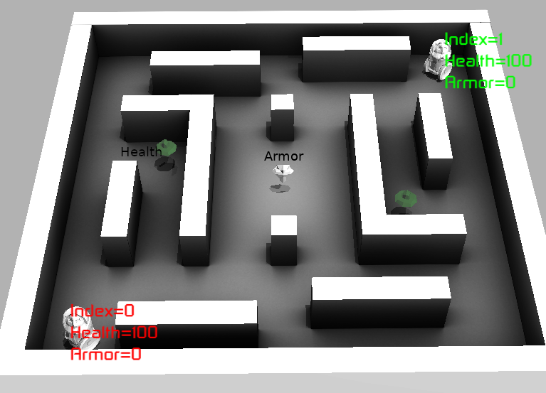
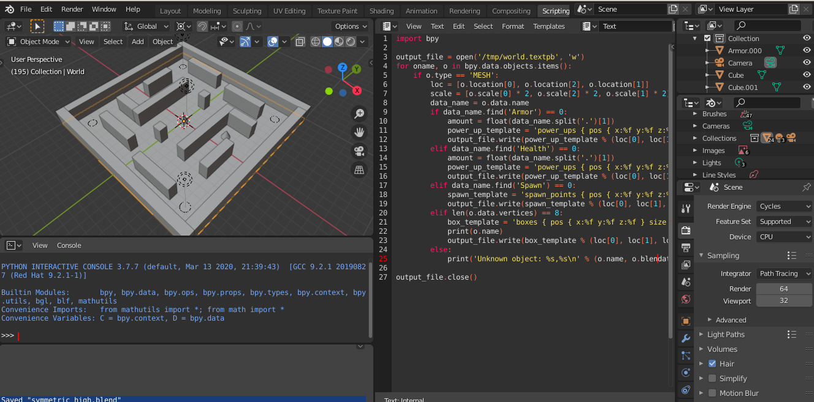
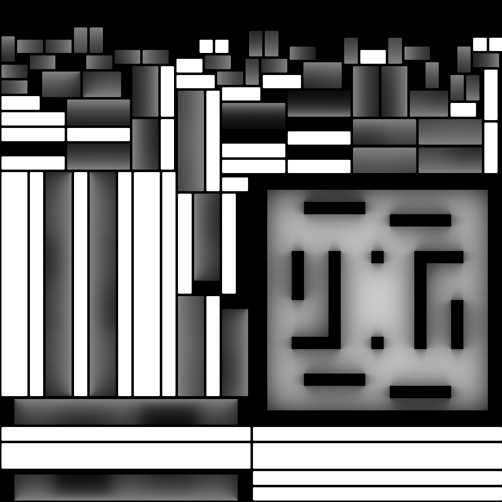
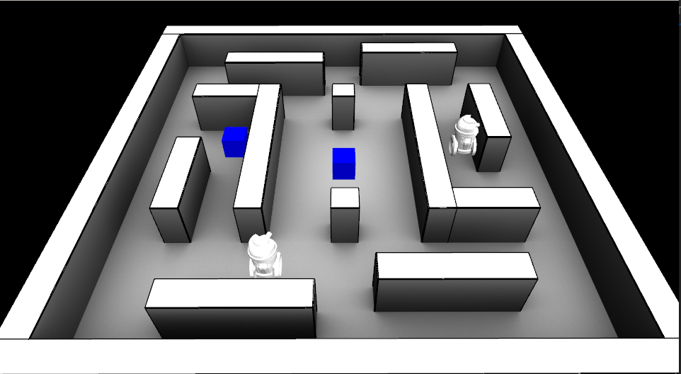

# Overview

This project contains a simulation environment for a stripped down version of a 1st-person shooter game. 
Agents can move around the environment and the objective is to shoot the opponent. The bullets look like little arrows
and do a certain amount of damage (armor limits the damage). 

Like Quake III (one of my all-time favorite games), there are some
power-ups (health and armor). Controlling power-ups is necessary to be successful in this death-match game (first to hit a certain number of kills in a given time frame). 

This was mostly a christmas vacation project (2020) to explore reinforcement learning. 
This simple environment and mechanics of the world (and physics) are written in c++, 
leveraging some old libraries I had from grad school, using
[Ogre](https://www.ogre3d.org/) for graphics, and with Python wrappers for training agents using
[Stable Baslines](https://stable-baselines.readthedocs.io/en/master) for the RL agents.




Some example videos:

* [Trained agent video](https://www.youtube.com/watch?v=adXGj-8ppU0): An example RL agent (index=0) pitted against a hand-coded agent (index=1).
* [1st-person video ](https://youtu.be/Dz061aS6qgM): It is possible to play against an agent in 1st-person mode. But the controls are not very fun.

## Requirements

(TODO: add links)

Most of the C++ dependencies can be found in the bazel WORKSPACE
file. The rest of the dependencies are:

* Bazel: https://bazel.build
* pybind11: https://pybind11.readthedocs.io/en/stable
* Personal libraries: nmath/nimage/nmisc
* stable-baselines: URL: https://github.com/hill-a/stable-baselines (Hash: 259f27868f0d727d990f50e04da6e3a5d5367582)
* Other;
  * Blender for models and level design (and export). 
  * Ogre for graphics
  * Cycles for rendering ambient occlusion
  


## Building

The environment/simulation code is written in c++. You must first
build the python module that will allow us to train an agent in python:

```
bazel build -c opt //src/python:battle_ai.so //src/ui:ui
```

### Source Layout

* [src/*.*](src): c++ code relating to the world / simulation environment
* [src/agent](src/agent): Code relating to agents
* [src/geometry](src/geometry): Simple collision detection
* [src/proto](src/proto): Protos that define agent state / observations
* [src/python](src/python): Python bindings for the c++ code
* [src/tools](src/tools): Binaries for validation and generation of ambient occlusion
* [src/ui](src/ui): Simple rendering / Ogre rendering / "UI code"


## Training a simple agent


Before trying to learn complicated strategies / agents (and
also since I have no idea what I'm doing), I created a simple agent
where the actions are which direction the agent should move,
and the reward is proportional to whether the agent picks up a
power-up or not.

Action Space:

*  Discrete direction (8-directions, sideways and diagonals)

Observation space

* 2D Position of the agent
* Agent health
* Agent armor
* Time until next powerup spawn

Reward:

* Increase in health or armor from getting a power-up
* Minus 1 if the action caused no movement (e.g., hitting a wall)
* [Optional] Small reward proportional to movement (commented out in code)


python/find_powerups.py
python/train_find_powerups.py

python3 train_find_powerups.py --model=DQN --train=True

For 1M iterations, you should start to see episode reward >= 140 (at about) 700K)

Expected behavior: go to 1 power-up, then over to another while one is still spawning,
 then back to another spawn point (etc.)


To simulate some runs with the agent, use:
```
python3 python/train_find_powerups.py --model=DQN --train=False
```

```
    env = find_powerups.FindPowerupsEnv(args.filename)
    env = make_vec_env(lambda: env, n_envs=1)
    model = QRDQN('MlpPolicy', env, verbose=2,
                  learning_rate = 0.0005, 
                  buffer_size=1000000,
                  exploration_initial_eps=1,
                  exploration_fraction=0.95,
                  exploration_final_eps=0.01)
    if not args.train:
        model.exploration_rate = 0.01
```

### Example Results
The resulting agent does learn to find the locations of 2 of the power-ups
(the health power up (middle left) and armor (center). The agent then 
seems to just sit idle in the top left corner waiting for the items to respawn.
There is another health on the right hand side that the agent doesn't find.


And you can see the results in the following video
 [single_agent_ui.mp4](https://www.youtube.com/watch?v=TCylBJaad6E).

## Training the high-level agent

As I didn't want to wait forever to train an agent capable of learning simple
strategies before learning any more higher-level behaviors, the high level
agent is parameterized using a higher-level set of actions.

Each step, the agent chooses from one of 4+N actions, where N is the number
of power ups in the level. There are 4 directional actions: forward, backward,
left, right.

For a new action (different from previous), the agent creates a plan in
the direction of movement (1 unit distance in the world) that includes
avoiding obstacles. The default size of the world is a [10, 10] and max
velocity is 4, so moving from one end of the world to the other takes 5 seconds.

The other N actions correspond moving along an optimal path towards one of the
powerups. Agent training happens at the granularity of 1/2 a second in the world
time, and the simulation runs 15 iterations with a time delta of 1/30th of a second
to achieve this.

In the case that the action is FORWARD and an opponent is visible, the search
plan will be along the direction to the opponent.

If the action is the same as the previous action, the same plan is followed
until it is complete (or action is changed). And if it is completed, a new
plan is created as described above.

Features / state include:

* 2D position of the agent.
* Agent's health and armor.
* For each power up:
  * Distance (of plan) for agent to powerup
  * Normalized time to respawn
  * Distance of the agent to the powerup
* Distance from agent to opponent agent (last position if known)	
* Distance from agent to wall in each direction (in each direction); maximum of 1
* Distance from agent to next point on the plan
* Last action.

The rewards tested include:

* No motion: penalty for not moving.
* Health increase: reward for an increase in health.
* Armor increase: reward for an increase in armor.
* Other health decrease: reward for when other agent health decreases (default = 0)
* Other armor decrease: reward for when other agent armor decreases (default = 0)
* Kill: reward for when agent kills other agent (default = 1).
* Die: reward for when agent dies (default = -0.01).
* Change plan: penalty for changing plan.

For the most part, I was unable to find a reward setting (and model / training parameters) that
gave a great AI agent. In general, keeping the "kill" reward to be high was mostly beneficial in 
getting an agent didn't do horrible.

#### Hard-coded SimpleAgent 
There is a hard-coded SimpleAgent ([simple_agent.cc](src/agent/simple_agent.cc)) is used as
 a training opponent that makes a plan and sticks to it with probability of 1 - replan_rate
(or if the path is obstructed). When considering a replan, with a probability of 
"favor_powerups", the agent will prefer to consider moving to a powerup.  Powerups
are considered if the agent would gain something from going to them (e.g., if they
need armor or health). Distance, time to respawn are factors in ranking powerup
priority. If there are no candidate powerups, the agent will do a random search.

The parameters controlling shoot_rate, shoot_confidence, and accuracy are common
between the hard-coded SimpleAgent and the RL high-level agent.

Lots of magic numbers in the implementation.
 

```
message SimpleAgentParams {
  optional double accuracy = 1 [default = 0.8];
  optional double replan_rate = 2 [default = 0.01];
  optional double shoot_rate = 3 [default = 0.5];
  optional double shoot_confidence = 4 [default = 0.0];
  optional double replan_obstruction_distance = 5 [default = 2.0];
  optional double aggressiveness = 6 [default = 0.5];
  optional double favor_powerups = 7 [default = 1.0];
}
```

#### Training:

```
python3 python/train_high_level.py --num_train_its=20000000 --train=1 --save_dir /tmp/high_level_env_20M --filename levels/world.textpb --n_steps 0
```

#### Evaluating:

```
python3 python/train_high_level.py --num_train_its=0 --train=0 --save_dir /tmp/high_level_env_20M --filename levels/world.textpb --n_steps 10000
```

### Results:

The "red" agent (index 0) is the RL trained agent. 
. 

See this [Video](https://www.youtube.com/watch?v=adXGj-8ppU0). 

Ultimately, learning to control the power-ups is key to being able to dominating here. While the agent does
pick up some of the power-ups, the strategy is clearly not optimal.


### Code links for high-level agent:

 * [python/high_level_env.py](python/high_level_env.py): The "gym" environment defining the simulation environment.
 * [python/train_high_level_agent.py](python/train_high_level_agent.py): Scripts to train the high-level agent.
 * [src/agent/high_level_agent.h](high_level_agent.h): Header for HighLevelAgent.
 * [src/agent/high_level_agent.h](high_level_agent.cc): Implementation of sensing/actions for the HighLevelAgent.
 * [src/agent/search.cc](src/agent/search.cc): Code for planning/searching the environment.


## Other things

### Making levels

There is an example level in levels/symmetric_high.blend. New level can be created by placing boxes and appropriately named circles (for spawn points) and cylinders for power-ups. The script to export the level is in that blend file.



### Benchmarking Hard-Coded Agents

Different hard-coded agents can be pitted against each other and evaluated.

See the example config [configs/benchmark.textpb](configs/benchmark.textpb)

```
bazel build -c opt //src/tools:benchmark_simple_agents
./bazel-bin/src/tools/benchmark_simple_agents --agent_filename configs/benchmark.textpb --level_filename levels/world.textpb --num_trials 100
```

Where you will be able to see how much more dominant an increase in say shooting accuracy will affect performance:

```
default vs zero_favor_powerups: 0.59
default vs no_favor_powerups: 0.34
default vs low_accuracy: 0.92
default vs medium_accuracy: 0.75
default vs high_accuracy: -0.25
default vs perfect_accuracy: -0.62
zero_favor_powerups vs no_favor_powerups: -0.34
zero_favor_powerups vs low_accuracy: 0.72
zero_favor_powerups vs medium_accuracy: 0.49
zero_favor_powerups vs high_accuracy: -0.85
zero_favor_powerups vs perfect_accuracy: -0.92
no_favor_powerups vs low_accuracy: 0.85
no_favor_powerups vs medium_accuracy: 0.66
no_favor_powerups vs high_accuracy: -0.76
no_favor_powerups vs perfect_accuracy: -0.8
low_accuracy vs medium_accuracy: -0.53
low_accuracy vs high_accuracy: -0.93
low_accuracy vs perfect_accuracy: -0.95
medium_accuracy vs high_accuracy: -0.9
medium_accuracy vs perfect_accuracy: -0.91
high_accuracy vs perfect_accuracy: -0.15

```

The output number is average of a per-trial score of -1, 0, or 1 depending on whether the config A hit a certain number of kills over config B. 
Positive number means config A is better than B. Number close to zero means similar performance.


There you will also see that increasing shoot_rate=1 and accuracy=0.5 would be roughly equivalent to accuracy=0.75 and shoot rate of 0.5 (the default).
Using [configs/accuracy_vs_shoot_rate.textpb](configs/accuracy_vs_shoot_rate.textpb):

```
accuracy_0.1 vs accuracy_0.25: -0.2
accuracy_0.1 vs accuracy_0.5: -0.43
accuracy_0.1 vs accuracy_0.75: -0.85
accuracy_0.1 vs accuracy_0.9: -0.93
accuracy_0.1 vs accuracy_0.5_shoot_rate_1.0: -0.82
accuracy_0.25 vs accuracy_0.5: -0.37
accuracy_0.25 vs accuracy_0.75: -0.86
accuracy_0.25 vs accuracy_0.9: -0.95
accuracy_0.25 vs accuracy_0.5_shoot_rate_1.0: -0.81
accuracy_0.5 vs accuracy_0.75: -0.7
accuracy_0.5 vs accuracy_0.9: -0.87
accuracy_0.5 vs accuracy_0.5_shoot_rate_1.0: -0.57
accuracy_0.75 vs accuracy_0.9: -0.53
accuracy_0.75 vs accuracy_0.5_shoot_rate_1.0: 0.04 <--------here-------
accuracy_0.9 vs accuracy_0.5_shoot_rate_1.0: 0.58
```

### Ambient occlusion using Cycles

If creating a new world, the corresponding mesh object and ambient occlusion texture can be created using the `bake_ambient_occlusion` tool:

```
bazel build -c opt src/tools:bake_ambient_occlusion 
./bazel-bin/src/tools/bake_ambient_occlusion --level_filename levels/world.textpb --output_path /tmp/baked.png --output_mesh /tmp/out.obj
```




### UI

This UI is mostly for debugging the environment and basic high-level agents. There is
no game mode (e.g., you can't die).
 
Press '0' to start the simulation:

```
./bazel-bin/src/ui/ui --filename levels/world.textpb \
  --agent_filename configs/demo.textpb --use_ogre=true
```

The `--agent_filename` controls which agents should be used in the simulation.

If `--user_agent=true` you can control the 0-th agent with Quake like settings 'w', 'a', 's', 'd' (for forward, strafe left, backward, strafe right) and ' ' for shoot. Use mouse to control direction.

The `--use_ogre` flag gives:

Use '1' to toggle 1st-person view. 

The `--use_orge=false` gives the simple UI;


